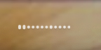
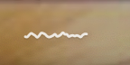
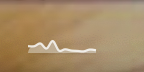

# SoundViz

[English](./README.md) | [简体中文](./README.zh-CN.md)

SoundViz is a native macOS menu bar audio visualizer. It reads system output audio through a Core Audio Process Tap, performs FFT analysis locally, and renders live spectral motion and beat pulses. Audio is processed in memory only; SoundViz does not record, save, upload, or play it.

## Features

- Three visualization styles: spectrum bars, waveform line, and spectrum area.
- 12 logarithmic frequency bands with per-band adaptive normalization.
- Selectable 8, 12, 16, or 24 frequency bands.
- Low-frequency spectral-flux beat pulses.
- Snappy, balanced, or smooth motion response presets.
- Independent 30 fps rendering clock.
- Automatic persistence of the selected style.
- A single-instance settings window for visualization preferences.
- Menu bar status, start/stop controls, and quit action.

## Build and Run

```bash
./build-app.sh
open build/SoundViz.app
```

Or use the Makefile:

```bash
make run
```

## Development

```bash
swift test          # Run tests
make icon           # Regenerate the app icon
make build          # Build and package the app bundle
make verify         # Test, package, and validate the bundle
make clean          # Remove build artifacts
```

CI uses a GitHub Actions `macos-15` runner to test, package, and validate the app bundle.

## Permissions

SoundViz does not use Screen Recording permission, so it does not show the purple screen-capture indicator. It requires macOS 14.2 or later and permission to read system audio. macOS may show this under **System Settings → Privacy & Security → Microphone/Audio Capture**.

## Visualization Styles

| Style | Menu bar effect | Description |
| --- | --- | --- |
| Spectrum bars |  | 12 logarithmic frequency bands; low frequencies are on the left and high frequencies on the right. |
| Waveform line |  | A time-domain waveform curve with DC offset removal and rolling peak normalization. |
| Spectrum area |  | A smooth spectral area where low-frequency beats drive edge pulses. |

Switch styles from the **Visualization Style** menu, or open **Settings…** to adjust visualization preferences. Changes apply immediately and are saved automatically.

## Architecture

```text
Core Audio Process Tap
        ↓
SystemAudioCaptureController
        ↓
SpectrumAnalyzer (FFT / bands / onset)
        ↓
AudioVisualizer (style rendering)
        ↓
NSStatusItem
```

The main source code is in `Sources/SoundViz`.

## Packaging and Signing

The default build uses ad-hoc signing, which is suitable for local prototype use:

```bash
./build-app.sh
```

To sign with a Developer ID certificate:

```bash
CODESIGN_IDENTITY="Developer ID Application: Your Name (TEAM_ID)" ./build-app.sh
```

Distribution to other Macs still requires notarization; this repository does not include a notarization workflow.

## Runtime Behavior

- Listening starts automatically when the app launches.
- The menu bar shows 12 spectral bands or a time-domain waveform.
- Visualization style can be switched between spectrum bars, waveform line, and spectrum area.
- The menu provides start/stop controls, permission status, and quit.
- The app itself does not record, save, or play audio.

## Limitations

- Requires macOS 14.2+ and Core Audio Process Tap.
- Developer ID signing and notarization are not configured.
- Core Audio Tap authorization behavior may vary across macOS releases.
- Sandbox, Developer ID notarization, and Sparkle updates are not included.

## License

This project is available under the [MIT License](LICENSE).
